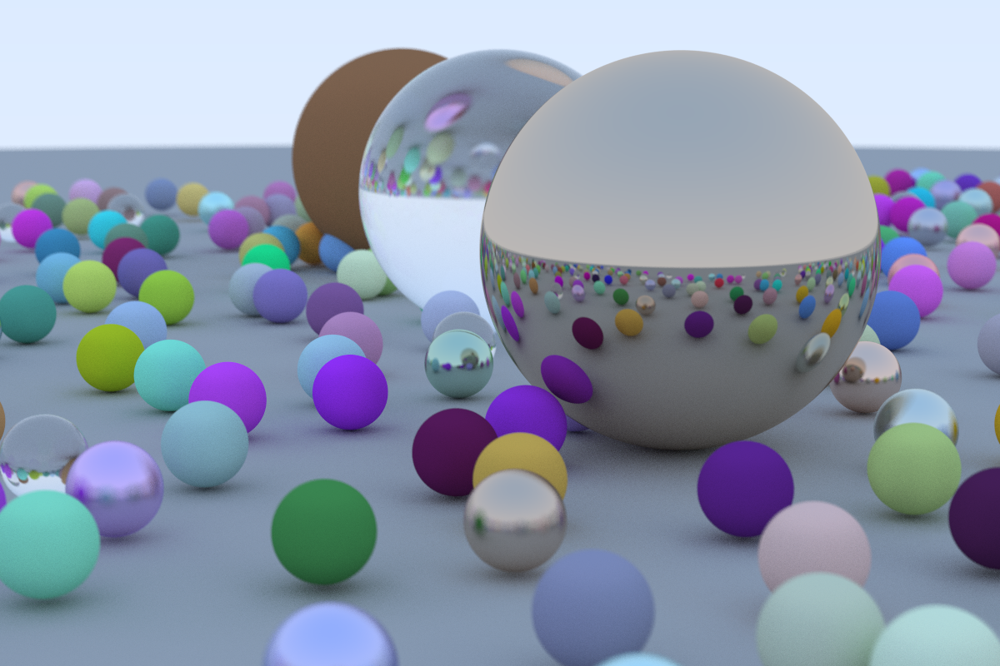

# Yet Another Raytracing in One Weekend in Rust

This is an implementation of a path tracer based on Peter Shirley's
book [Ray Tracing In One Weekend](https://raytracing.github.io/books/RayTracingInOneWeekend.html) in Rust.

## Rust dependencies

- [glam](https://github.com/bitshifter/glam-rs) for vector math. The API is neat and it has SIMD.
- [rayon](https://github.com/rayon-rs/rayon) to make it run in parallel.
- [image-rs](https://github.com/image-rs/image) for the image IO.

## Additional useful links

- [A thread](https://users.rust-lang.org/t/peter-shirleys-ray-tracing-in-one-weekend-implementation-in-rust/26972/2) in rust-users 
- [Slides from a lecture at CMU about Monte-Carlo integration in Path Tracing](http://15462.courses.cs.cmu.edu/fall2018/lecture/montecarloraytracing)
- [A series of lectures at TU Wien](https://www.youtube.com/watch?v=sg2xdcB8M3c&list=PLmIqTlJ6KsE2yXzeq02hqCDpOdtj6n6A9&index=11)

